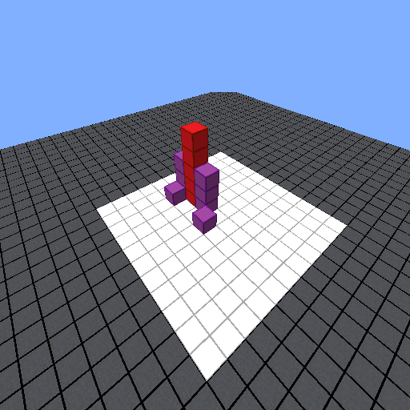

# MM-IGLU-IT: Multi-Modal Interactive Grounded Language Understanding in Italian

This repository contains data and description for **MM-IGLU-IT**, a project focused on *Multi-Modal Interactive Grounded Language Understanding in Italian*. This work has been accepted at the [23rd International Conference of the Italian Association for Artificial Intelligence (AIxIA 2024)](https://aixia2024.events.unibz.it/) and it is published by: **Federico Borazio** (University of Rome Tor Vergata), **Claudiu Daniel Hromei** (University of Rome Tor Vergata), **Elisa Passone** (University of Rome Tor Vergata), **Danilo Croce** (University of Rome Tor Vergata) and **Roberto Basili** (University of Rome Tor Vergata) .

## Overview

**MM-IGLU-IT** is a multi-modal model designed for Interactive Grounded Language Understanding tasks in Italian. This resource builds upon previous work, notably the [IGLU dataset](https://github.com/microsoft/iglu-datasets) competition and [MM-IGLU](https://github.com/crux82/MM-IGLU/) experience. While these resources were limited to English, **MM-IGLU-IT** breaks new ground by introducing and evaluating a model that leverages a **new Italian dataset**, derived from the English version of **MM-IGLU**. This dataset was created through a combination of **automatic translation** and **rigorous manual validation**, ensuring both linguistic accuracy and naturalness in Italian.

### Task Description

The dataset simulates a scenario where a **Human Architect** issues commands in natural language to a **Robotic Builder** within a 3D environment. The Robotic Builder must:

1. Assess whether the command is clear and can be executed in the current world.
2. If more information about the command is needed, ask clarifying questions.

### Example Scenario

Here is an example 3D world snapshot:



#### Ambiguous command: *"Rompi i blocchi verdi"* (*Break the green blocks*)  
- **Response**: *"Non ci sono blocchi verdi. Quale blocco devo rompere?"* (*There are no green blocks. Which block should I break?*)  

#### Clear/Executable command: *"Rompi i blocchi rossi"* (*Break the red blocks*)  
- **Response**: *"Posso eseguirlo."* (*I can execute it.*)  

This dataset enables testing and training of models that can understand Italian commands in complex visual contexts. 

---

## Dataset

**First Italian IGLU Multimodal Dataset** 🚀

**Over 6.800 command-response examples!** 📈

**Human validation and adjustment** 💁

The MM-IGLU-IT resource derived from MM-IGLU dataset and it is obtained through automatic translation using [DeepL](https://www.deepl.com/it/translator), followed by human manual validation to ensure naturalness and faithfulness. This process ensures high-quality Italian translations for training and evaluation.

In `data/mm-iglu-it_dataset` you can find our split into Train/Val/Test files.
| **Section**  | **#Examples**    | **#Clear**    | **#Ambiguous** | 
|--------------|------------------|---------------|----------------|
| Train        | 5,530            | 4,813         | 717            |
| Val          | 615              | 531           | 84             |
| Test         | 683              | 593           | 90             |

The table shows the number of examples available in each split (Train, Validation, and Test), along with a categorization of the commands into Clear and Ambiguous cases:

**Clear Commands**: These are commands that can be directly executed by the Robotic Builder without requiring any clarification. Examples include instructions that are specific and unambiguous in the given 3D context.

**Ambiguous Commands**: These are commands that lack sufficient information for direct execution, prompting the Robotic Builder to ask clarifying questions. Examples include commands referring to objects or conditions not present in the scene.

 Each row of the dataset is made of a unique ID, the path to the 3D image, the command, a flag to mark if the command is clear or ambiguous, the most relevant question or the answer "*I can execute it*" and, the path to the JSON file containing the information about the world. Here we show an example:

| **ID**  | **Image path**    | **Command** | **Is command clear** | **Expected ouptut** | **World Path**   |
|-----------------|-------------|----------------|-------------|-------------|-------------|
| CQ-game-3053  | ./data/images/CQ-game-3053.png | Impila quattro blocchi rossi sopra il blocco.  |    Yes | Posso eseguirlo. | data/iwp/12-c139/step-4 |   
| CQ-game-4622 |  ./data/images/CQ-game-4622.png | Aggiungere 2 blocchi gialli nella parte inferiore della colonna per fissarlo al pavimento. Poi aggiungere una colonna in ogni spazio bianco sul pavimento diagonale alla colonna gialla (4 nuove colonne) |  No | Di che colore devono essere le colonne diagonali? |  data/iwp/13-c75/step-2  |   

---

## How to train and use a multi-modal LLM over MM-IGLU-IT

To tackle this task, we developed a **multi-modal model** based on [LLaVA](https://github.com/haotian-liu/LLaVA) architecture. This model integrates:  
- **[CLIP](https://github.com/openai/CLIP)**: For processing 3D images.  
- A **Language Model**: For generating responses, with the best results achieved using **LLaMA-2-Chat-13B**.

This study builds upon prior work; for further details, please refer to [English repository](https://github.com/crux82/MM-IGLU/)

---

## Evaluating multi-modal LLM over MM-IGLU-IT

### Table of results

- The <i>Eval task</i> are: 
  - "*Classification*" evaluates the ability to asses whether a command is executable or not (*Yes/No* answers).
  - "*Generation*" evaluates the ability of the model to produce a question if the command is not clear or the answer "*I can execute it*" when it is clear. 
  
If you want more details, please consult the paper.

| **Model name**  | **Eval task**    | **Train lang** | **Test lang** | **F1 Pos**  | **F1 Neg**  | **Macro\-F1** |
|-----------------|-------------|----------------|-------------|-------------|---------------|---------------|
| [LLaVALLaMA2Chat\-13b-EN](https://huggingface.co/sag-uniroma2/llava-Llama-2-chat-13b-hf-iglu-merged) |    Classification | EN  |    EN  | 96\.43%     | 67\.16%      | 81\.80%       |
| [LLaVALLaMA2Chat\-13b-EN](https://huggingface.co/sag-uniroma2/llava-Llama-2-chat-13b-hf-iglu-merged) | Classification  | EN |  IT  | 70\.07%     | 24\.29%     | 47\.18%       |
| [LLaVALLaMA2Chat\-13b-IT](https://huggingface.co/sag-uniroma2/llava-Llama-2-chat-13b-hf-iglu-merged-it) | Classification | IT |   IT  | 97\.81% | 66\.67% | 82\.24%   |
| [LLaVALLaMA2Chat\-13b-EN](https://huggingface.co/sag-uniroma2/llava-Llama-2-chat-13b-hf-iglu-merged) | Generation | EN  |    EN  | 93\.95%     | 47\.89%      | 70\.92%       |
| [LLaVALLaMA2Chat\-13b-EN](https://huggingface.co/sag-uniroma2/llava-Llama-2-chat-13b-hf-iglu-merged) | Generation  | EN |  IT  | 70\.01%     | 00\.00%     | 35\.00%       |
| [LLaVALLaMA2Chat\-13b-IT](https://huggingface.co/sag-uniroma2/llava-Llama-2-chat-13b-hf-iglu-merged-it)| Generation | IT |   IT  | 93\.62% | 44\.16% | 68\.89%  |

The models are trained following the multi-task adaptation schema. See the paper for more details.

# Citation
To appear in:
```
@inproceedings{DBLP:conf/aiia/BorazioHPCB24,
  author       = {Federico Borazio and
                  Claudiu Daniel Hromei and
                  Elisa Passone and
                  Danilo Croce and
                  Roberto Basili},
  title        = {{MM-IGLU-IT}: Multi-Modal Interactive Grounded Language Understanding in Italian},
  booktitle    = {AIxIA 2024 - Advances in Artificial Intelligence - XXIIIrd International
                  Conference of the Italian Association for Artificial Intelligence,
                  AIxIA 2024, Bolzano, Italy, November 25 - November 28, 2024, Proceedings},
  series       = {Lecture Notes in Computer Science},
  volume       = {},
  pages        = {},
  publisher    = {Springer},
  year         = {2024},
  url          = {}
}
```